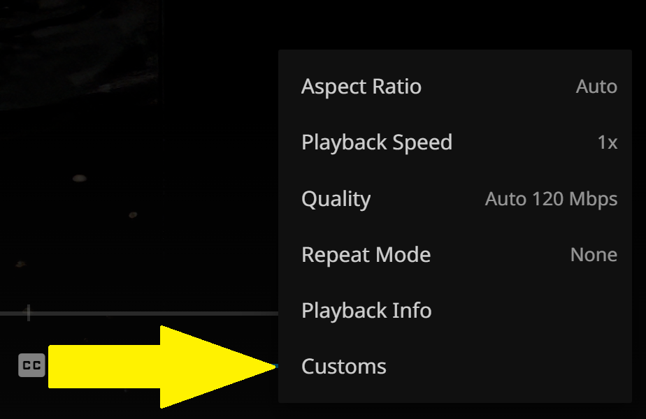
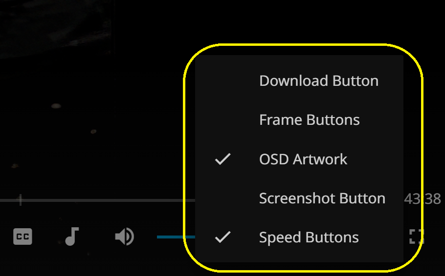

Overview of all my Jellyfin Web VideoOSD projects: [Jellyfin-VideoOSD-Projects-Overview](https://github.com/chrissix666/Jellyfin-VideoOSD-Projects-Overview)

---

# Jellyfin VideoOSD Custom On/Off Menu

This script is the quick-switching control hub for my **Jellyfin VideoOSD mods**.  
It adds a customizable on/off submenu to the playback menu, letting you quickly enable or disable supported script mods directly during video playback.

Supported mods:

- [Artwork on OSD](https://github.com/chrissix666/Jellyfin-VideoOSD-Artwork-Display)
- [Speed Buttons](https://github.com/chrissix666/Jellyfin-VideoOSD-CustomPlaybackSpeed-Buttons)
- [FrameByFrame Buttons](https://github.com/chrissix666/Jellyfin-VideoOSD-FrameByFrame-Buttons)
- [Download Button](https://github.com/chrissix666/Jellyfin-VideoOSD-Download-Button)
- [Screenshot Button](https://github.com/chrissix666/Jellyfin-VideoOSD-Screenshot-Button)

Supported scripts can register themselves in the menu and can then be enabled or disabled without editing code or reloading Jellyfin Web.

Tested on & Requirements: Windows 11, Chrome, Jellyfin Web 10.10.7, JavaScript Injector.

---

## Features

- Adds a **Customs** submenu to the Jellyfin VideoOSD menu.
- Shows supported OSD script mods in one compact on/off list.
- Uses checkmarks to show which mods are currently enabled.
- Stores addon states locally in the browser.
- Compatible scripts can register automatically through the shared Custom Menu integration.
- Uses Jellyfin-like ActionSheet styling for a native-looking popup.
- Works fully client-side, without backend changes.

---

## What This Script Does

The Custom On/Off Menu is not a visual effect or playback feature by itself.  
It is a small control layer for other VideoOSD mods.

Instead of editing scripts manually whenever you want to hide or show a button, artwork overlay, or other OSD element, you can toggle supported mods directly from the VideoOSD menu.

This is useful when you use multiple OSD mods together and want a clean way to quickly switch them on or off depending on the situation.

---

## Supported Addons

This menu is designed for VideoOSD scripts that include Custom Menu integration.

Currently supported:

- **Artwork OSD**  
  Enables or disables the VideoOSD artwork overlay.

- **Speed Buttons**  
  Enables or disables the custom playback speed step buttons.

- **FrameByFrame Buttons**  
  Enables or disables frame stepping buttons for precise paused playback navigation.

- **Download Button**  
  Enables or disables the VideoOSD download button.

- **Screenshot Button**  
  Enables or disables the VideoOSD screenshot button.

If no compatible addon is installed or registered, the menu shows a small empty-state message.

---

## Installation

1. If not already present, install a JavaScript injector plugin or userscript manager  
   (Jellyfin JavaScript Injector, Tampermonkey, Violentmonkey, or similar).

2. Paste the content of the Custom On/Off Menu script into the injector.

3. Make sure this menu script loads **before** the supported OSD addon scripts when possible.

4. Paste or enable the supported OSD addon scripts.

5. Save and reload Jellyfin Web.

6. Start video playback and open the VideoOSD menu.

---

## Behavior

The script creates a shared Custom Menu integration for supported VideoOSD addons.

Compatible addons can register themselves with the menu.  
Each registered addon appears as a toggle entry in the submenu.

When an addon is enabled or disabled:

- The state is saved locally in the browser.
- The addon’s own enable or disable behavior is triggered.
- The checkmark updates immediately.
- No Jellyfin server setting is changed.
- No backend interaction is required.

---

## Storage

Addon states are saved locally in the browser.

This means the settings are browser-local and user-local.  
Clearing browser storage may reset the menu states.

---

## Notes and Limitations

- This menu only controls scripts that support the Custom Menu integration.
- It does not modify Jellyfin server settings.
- It does not install or remove addons.
- It only enables or disables already loaded compatible scripts.
- Load order can matter. For best results, load the Custom On/Off Menu before the addon scripts.
- If a compatible addon is used without this menu, it can still run standalone if the addon script supports fallback behavior.

---

## Tested On

- Jellyfin Web 10.10.7
- Google Chrome
- Windows 11

---

## License

MIT
